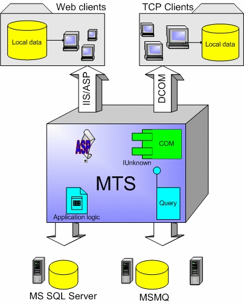

# DCOM
***DCOM* - программная архитектура, разработанная компанией Microsoft для распределения приложений между несколькими компьютерами в сети. Программный компонент на одной из машин может использовать **DCOM** для передачи сообщения (его называют удаленным вызовом процедуры) к компоненту на другой машине. **DCOM** автоматически устанавливает соединение, передает сообщение и возвращает ответ удаленного компонента.**

**COM** и **DCOM** - технологии, обеспечивающие взаимодействие между компонентами приложения и позволяющие развертывать распределенное приложение на платформе Windows. **COM** является моделью программирования на основе объектов, которая упрощает взаимодействие различных приложений и компонентов, а **DCOM** - это своего рода "клей", связывающий воедино разнообразные технологии, применяемые в распределенных приложениях. 

**DCOM** дает возможность двум или нескольким компонентам легко взаимодействовать друг с другом независимо от того, когда и на каком языке программирования они были написаны, а также где именно они находятся и в какой операционной системе работают.

Распределенные многопользовательские приложения могут модифицировать таблицы базы данных и взаимодействовать даже на другие сущности, не имеющие отношения к базам данных, например на очереди сообщений. Транзакции реализуют простой механизм выполнения операции по принципу "все или ничего". Операция считается выполненной только при успешной модификации всех участвующих в ней объектов, а при неудачном изменении одного из них вся операция отменяется.

Преимуществом **DCOM** является значительная простота использования. Если программисты пишут свои Windows-приложения с помощью ActiveX (предлагаемого Microsoft способа организации программных компонентов), то операционная система будет автоматически устанавливать необходимые соединения и перенаправлять трафик между компонентами, независимо от того, размещаются ли компоненты на той же машине или нет.

Способность **DCOM** связывать компоненты позволила Microsoft наделить Windows рядом важных дополнительных возможностей, в частности, реализовать сервер Microsoft Transaction Server, отвечающий за выполнения транзакций баз данных через Internet. Новая же версия COM+ еще больше упростит программирование распределенных приложений, в частности, благодаря таким компонентам, как базы данных, размещаемые в оперативной памяти.

Однако у **DCOM** есть ряд недостатков. Это решение до сих пор ориентировано исключительно на системы Microsoft. **DCOM** изначально создавалась под Windows. Хорошо известно, что Microsoft заключила соглашение с компанией Software AG, предмет которого - перенос **DCOM** на другие платформы.

В числе недостатков и то, что архитектура предусматривает использование для поиска компонентов в сети разработанной Microsoft сетевой службы каталогов Active Directory, появившейся в Windows начиная с версии 2000. Это приводит к зависимости пользователя от соотвествующих служб Microsoft и резко снижает безопасность использования такой технологии.
